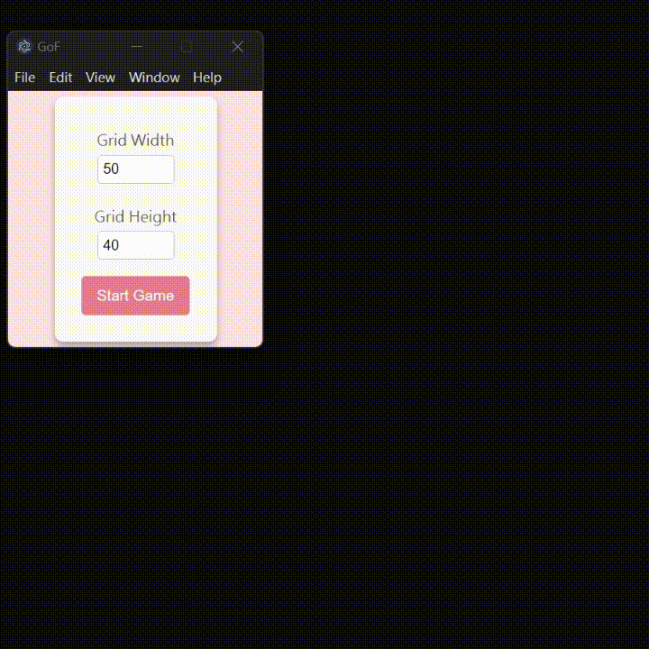

# Game of Life 

This is an implementation of Conway's classic Game of Life using Electron. I try to utilize [nippon colors](https://nipponcolors.com/) to create a more japanese-feminine design :kissing_closed_eyes:

<p align="center">
    
</p>

## Current Features
- Configurable grid size (width and height)
- High-class UI design with elegant font styling
- Start, stop, and reset functionality

## Installation

### Prerequisites
- [Node.js](https://nodejs.org/) 
- [Electron](https://www.electronjs.org/)

### Setup
1. Clone the repository:
   ```sh
   git clone https://github.com/yourusername/game-of-life.git
   cd game-of-life
    ```
2. Install dependencies and start:
    ```sh
    npm install
    npm start
    ```